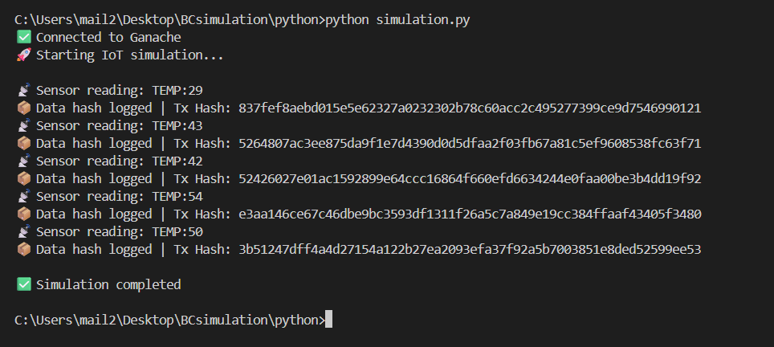
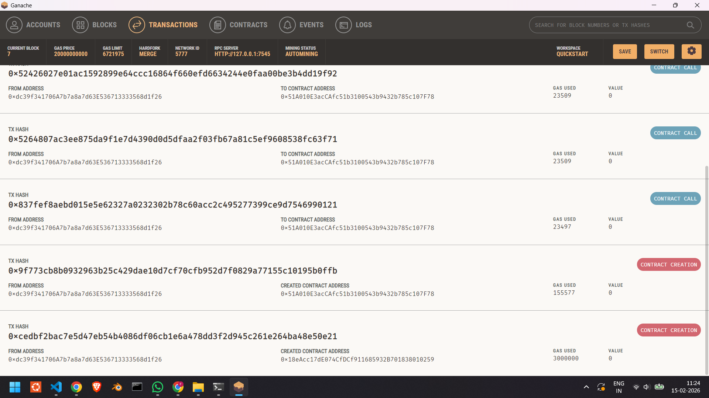
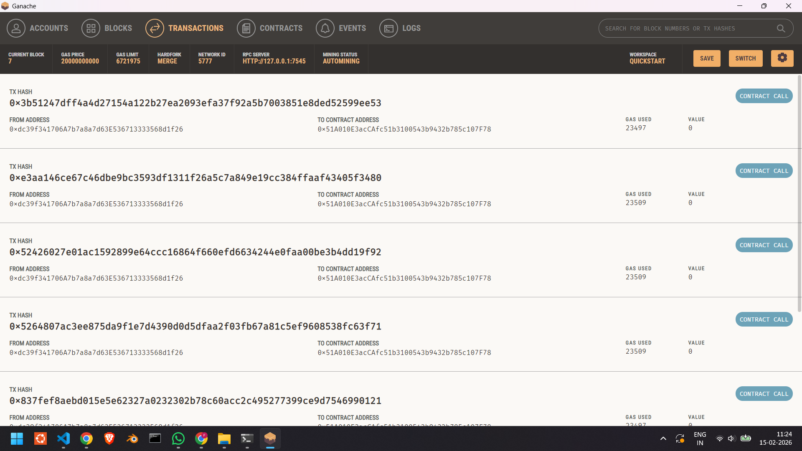
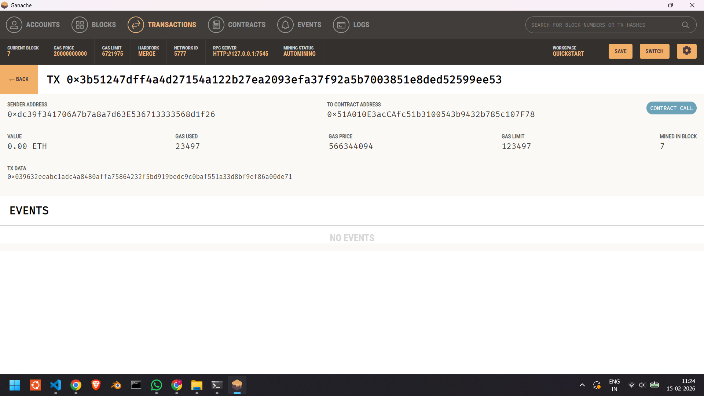
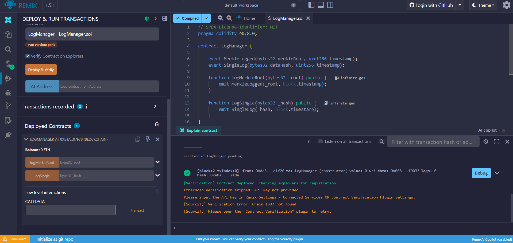

# Blockchain-Based Secure IoT Data Logging Simulation

## Overview
This project demonstrates how **blockchain technology** can be used to **secure IoT data** by ensuring data integrity, immutability, and transparency.  
Instead of storing raw IoT sensor data on-chain, the system **hashes sensor readings** and stores only the cryptographic hash on a **local Ethereum blockchain**.

The simulation is implemented using:
- Solidity smart contracts
- Ganache (local blockchain)
- Remix IDE
- Python (Web3.py)


## Project structure
```text
BCsimulation/
├── blockchain/
│   └── LogManager.sol    # Smart contract for data logging
├── python/
│   └── simulation.py     # IoT data generation script
├── report/
│   └── screenshots/      # Experiment evidence & results
└── README.md             # Project overview
```


## Setup & Configuration Guide

### Step 1: Start Ganache (Local Blockchain)

1. Open **Ganache GUI**
2. Click **Quickstart Ethereum**
3. Note the following details:
   - **RPC Server**: `http://127.0.0.1:7545`
   - **Network ID**: `5777`
4. Keep Ganache running throughout the experiment

Ganache provides pre-funded Ethereum accounts for testing.

---

### Step 2: Deploy Smart Contract Using Remix

1. Open **Remix IDE** in your browser  
   https://remix.ethereum.org
2. Create a file:
```bash
LogManager.sol
```
3. Paste the smart contract code
4. Go to **Solidity Compiler**
- Compiler version: `0.8.x`
- Click **Compile**
5. Go to **Deploy & Run Transactions**
- Environment: **Dev – Ganache Provider**
- Confirm connection to network ID `5777`
6. Click **Deploy**

---

### Step 3: Get Contract Address

After deployment:

1. In **Deploy & Run Transactions**
2. Expand **Deployed Contracts**
3. Copy the address shown
4. Paste it in simulation.py

### Step 4: Get Contract ABI

In Remix, open Solidity Compiler

1. Select LogManager.sol

2. Click the ABI button

3. Copy the entire JSON array (starts with [ and ends with ])

4. Paste it in simulation.py

---

### Step 5: Install Required Python Libraries
```bash
pip install web3 eth-utils
```
---

### Step 7: Run the Simulation
```bash
cd python
python simulation.py
```
---
## Results

### Python Simulation Output


### Ganache Transaction View


### Ganache Transaction View


### Transaction Details


### Smart Contract Events



