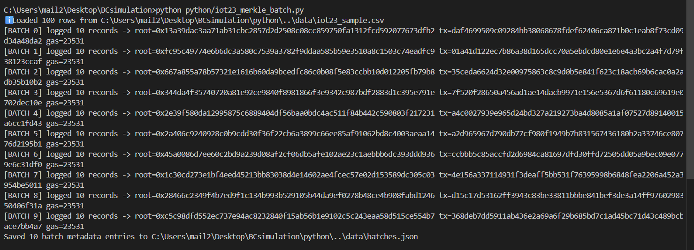
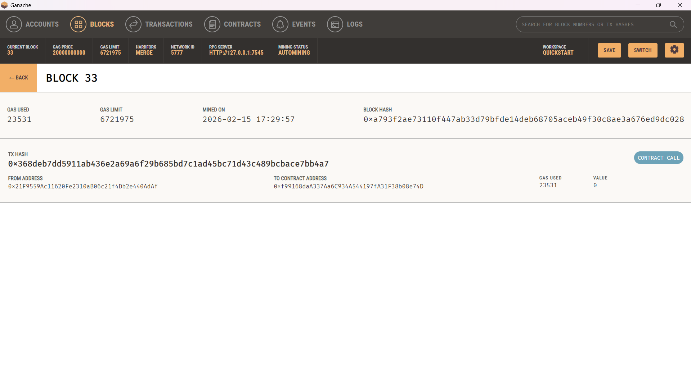
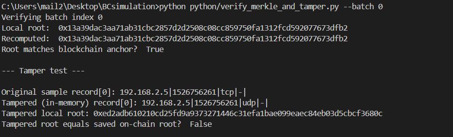

# Blockchain-Based Secure IoT Data Logging - merkle-batching

## Overview

This branch demonstrates how blockchain can secure IoT data integrity by hashing sensor records (data + timestamp + device id), aggregating hashes into Merkle trees, and anchoring only the Merkle roots on a local Ethereum chain. Raw IoT data stays off-chain (in data/), while data/batches.json holds the off-chain batch contents needed for verification and proof generation.

---
## Dataset
IoT dataset: subset derived from Stratosphere IPS’s IoT-23. Kaggle hosts convenient preprocessed copies.

---


## Project structure
```text
BCsimulation/
├── blockchain/
│   └── LogManager.sol             # contract
├── data/
│   ├── iot23_sample.csv           # sample rows 
│   └── batches.json               #(off-chain batch store)
├── python/
│   ├── iot23_merkle_batch.py
│   └── verify_merkle_and_tamper.py
├── report/
│   └── screenshots
└── README.md  
```

---
## Quick summary of the protocol

1. Read IoT CSV row → build canonical string
device_id | timestamp | proto | service | label

2. leaf_hash = keccak256(leaf_text) (32 bytes) — each leaf binds data+time+device

3. Collect BATCH_SIZE leaf_hash values → build Merkle tree (pair concat → keccak)

4. MerkleRoot (top hash) → LogManager.logMerkleRoot(root) (one tx per batch)

5. Save batch metadata off-chain to batches.json:

   batch_index, root (hex), tx hash, gas used, and the textual records[]

6. Verify by recomputing leaf hashes and Merkle root from batches.json and comparing with anchored root. Tamper detection: altered off-chain data → recomputed root ≠ anchored root.


## Setup & Configuration is similar to main branch.


## Run merkle batching
```bash
python python/iot23_merkle_batch.py
```
Reads iot23_sample.csv.

For every BATCH_SIZE records computes root and calls logMerkleRoot(root).

Produces data/batches.json (one entry per committed batch).

---
## Verify and Tampering
```bash
python python/verify_merkle_and_tamper.py --batch 0 --tamper-csv data/iot23_altered.csv
```
---

## Output
### Merkle batching


### Merkle batching


### Tamper Testing


---


